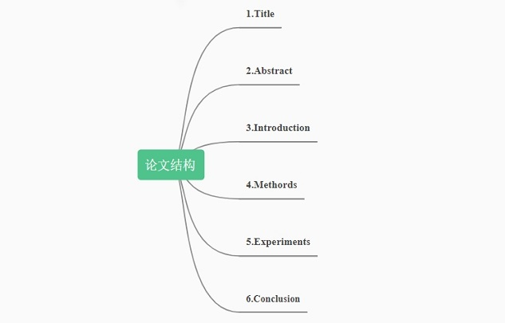

# how-to-read-paper

### 前言
分享经典的计算机领域论文和读论文的方法。

### TODO
- [ ] 读深度学习相关论文
- [ ] 复现论文代码

### 论文结构

### 如何读论文
#### 第一遍
题目 $\longrightarrow$ 摘要 $\longrightarrow$ 结论 (粗读)

实验(跳到实验部分看关键的图和表) $\longrightarrow$ 方法(看方法中的图和表)

#### 第二遍
整篇文章过一遍，可以不在意公式和不理解的细节，但要清楚每个点讲的是什么，标记出引用的文献，也可以去阅读这些文献。

#### 第三遍
精读全文，清楚每句话讲的是什么，了解整篇文章的行文结构、算法流程。
